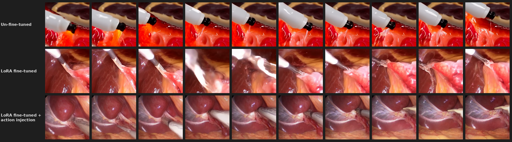

<div align="center">

<h1>SurgActionGen</h1>

<p><em>Surgical video generation that actually moves like surgery.</em></p>

<p>
  <a href="#"></a>
  <a href="#"></a>
  <a href="#"></a>
  <a href="#"></a>
  <a href="LICENSE"></a>
</p>

<br>



<p><sub>
  <b>Top:</b> Wan2.1 (no fine-tuning) &nbsp;·&nbsp;
  <b>Middle:</b> Wan2.1 + LoRA &nbsp;·&nbsp;
  <b>Bottom:</b> Wan2.1 + LoRA + <b>SurgActionGen</b> — stable, coherent surgical motion
</sub></p>

</div>

---

## The Problem

Standard text-to-video models have never seen an operating room. They generate surgical scenes that *look* right but *move* wrong — instruments jitter, the camera shakes, temporal coherence collapses.

The fix isn't more LoRA fine-tuning. It's **motion priors from real surgery**.

---

## What We Do

We extract the motion signature of 5,209 real Cholec80 surgical clips, compress it into a 128-dim latent code `z`, and inject it into a frozen Wan2.1 DiT through two lightweight adapters. The base model never changes. The motion does.

<div align="center">

```
  "laparoscopic cholecystectomy,          →    Wan2.1-T2V-1.3B
   clipping the cystic duct"                   (frozen weights)
           │                                         ↑
           │  CLIP ViT-L/14                          │  forward hooks
           ▼                                         │
      ZPredictor          z_seq (32×128) ──── WanActionAdapter
   (text → motion)           ↑                  (2M params)
                             │
                     FlowAutoEncoder
                  (real Cholec80 motion)
```

</div>

Three stages. One forward pass at inference. No reference video needed.

---

## Results

### Main Results (200 prompts)

<div align="center">

| | TOFV-Var ↓ | Flow Smooth ↓ | LPIPS-Mean ↓ | LPIPS-Var ↓ | CLIP ↑ | Motion ↑ | Dyn. Deg. ↑ | BG Consist. ↑ | Subj. Consist. ↑ |
|:---|:---:|:---:|:---:|:---:|:---:|:---:|:---:|:---:|:---:|
| Baseline | 3.139 | 1.258 | 1.373 | 0.755 | 0.249 | 0.979 | 0.850 | 0.941 | 0.895 |
| LoRA | 3.758 | 1.721 | 3.039 | 2.290 | 0.273 | 0.971 | 0.985 | 0.943 | 0.872 |
| **Ours** | **3.533** | **1.603** | **2.929** | **2.172** | **0.274** | **0.973** | **0.990** | **0.946** | **0.879** |
| Δ vs LoRA | −6.0% | −6.9% | −3.6% | −5.2% | +0.2% | +0.2% | +0.5% | +0.3% | +0.8% |

*Adapter scale = 0.5. Dynamic degree fully preserved. Evaluated on 200 surgical text prompts.*

</div>

The adapter improves every motion stability metric over LoRA without sacrificing semantic fidelity (CLIP score) or dynamic degree.

### Adapter Scale Ablation (10 prompts)

<div align="center">

| Scale | TOFV-Var ↓ | Flow Smooth ↓ | LPIPS-Mean ↓ | LPIPS-Var ↓ | Motion ↑ | BG Consist. ↑ |
|:---:|:---:|:---:|:---:|:---:|:---:|:---:|
| LoRA | 2.637 | 1.488 | 2.892 | 2.201 | 0.9730 | 0.9303 |
| 0.1 | 2.491 | 1.496 | 2.815 | 2.104 | — | — |
| 0.3 | 2.543 | 1.368 | 2.747 | 1.977 | 0.9738 | 0.9434 |
| **0.5** ⭐ | **2.384** | **1.263** | **2.608** | **1.669** | **0.9755** | **0.9433** |
| 0.7 | 2.717 | 1.322 | 2.561 | 1.567 | 0.9750 | 0.9482 |
| 1.0 | 2.311 | 1.263 | 2.450 | 1.664 | — | — |

</div>

Scale = 0.5 achieves the best joint improvement across flow variance, smoothness, and LPIPS. Higher scales (≥ 0.7) trade off flow variance stability for lower LPIPS.

---

## Dataset Preparation

Our dataset integrates two publicly available surgical datasets.  You must
download them directly from the official sources under their respective
license terms before running any preparation scripts.

| Dataset | Source | Notes |
|:--------|:-------|:------|
| **Cholec80** | [https://camma.unistra.fr/datasets/](https://camma.unistra.fr/datasets/) | 80 laparoscopic cholecystectomy videos at 25 FPS with phase annotations. Request access via the CAMMA group. |
| **CholecT50** | [https://github.com/CAMMA-public/cholect50](https://github.com/CAMMA-public/cholect50) | Instrument-verb-target triplet annotations (1 FPS) for 45 Cholec80 videos. |

Once downloaded, run the two preparation scripts in order:

```bash
conda activate cogvideox   # or any env with opencv, tqdm, ffmpeg

# Step 1 — Map CholecT50 timestamps → Cholec80 clips (~15 min)
python data_preparation/01_extract_action_clips.py \
    --cholec80_dir /path/to/cholec80 \
    --anno_dir     /path/to/cholect50/annotations \
    --out_dir      data/cholec80_action \
    --min_sec      3

# Step 2 — Generate captions from triplets
#   Option A: template-based (fast, no API key)
python data_preparation/02_generate_captions.py \
    --metadata data/cholec80_action/clips_metadata.json

#   Option B: GPT-4o (richer captions, matches paper quality)
export OPENAI_API_KEY=sk-...
python data_preparation/02_generate_captions.py \
    --metadata    data/cholec80_action/clips_metadata.json \
    --backend     openai  --model gpt-4o  --max_workers 16
```

This produces:
- `data/cholec80_action/clips/` — 5,209 short MP4 clips
- `data/cholec80_action/clips_metadata.json` — per-clip frame ranges and triplets
- `data/cholec80_action/clips_captions.json` — per-clip captions (input for training)

> **License note:** Cholec80 and CholecT50 are released for non-commercial
> research use only.  The dataset preparation code is provided to reproduce
> our results; redistribution of the derived clips is not permitted without
> the original rights-holders' consent.

---

## Quickstart

**Prereqs:** Wan2.1-T2V-1.3B weights · Cholec80 + CholecT50 (see above) · CUDA 11.8+

```bash
# 1. Clone + install
git clone https://github.com/Punktheory/SurgActionGen
cd SurgActionGen

conda create -n cogvideox python=3.10 && conda activate cogvideox
pip install torch==2.7.1+cu118 torchvision --index-url https://download.pytorch.org/whl/cu118
pip install -r requirements.txt

git clone https://github.com/Wan-Video/Wan2.1 /path/to/Wan2.1

# 2. Run inference (single GPU, 2 prompts to verify)
python inference/run_inference.py \
    --wan_dir /path/to/Wan2.1 \
    --gpu 0 --start_idx 0 --end_idx 2
```

Output appears in `final_result/`. Each prompt produces 7 videos: baseline, LoRA, and 5 adapter scales.

---

## Training

<details>
<summary><b>Step 0 — Preprocess Cholec80</b> (raft env)</summary>

```bash
conda create -n raft python=3.10 && conda activate raft
pip install torch==2.6.0+cu124 torchvision --index-url https://download.pytorch.org/whl/cu124
pip install opencv-python numpy omegaconf tqdm

python scripts/prepare_cholec80_laof.py \
    --clip_dir data/cholec80_action/clips \
    --out_dir  data/processed/cholec80_laof_256 \
    --gpus 0,1,2,3,4,5,6,7
```
</details>

<details>
<summary><b>Step 1 — Train FlowAutoEncoder</b> (raft env)</summary>

```bash
CUDA_VISIBLE_DEVICES=0,1,2,3,4,5,6,7 torchrun \
    --nproc_per_node=8 --master_port=29505 \
    laof/cholec80_stage1_v6.py \
    --steps 50000 --bs 64 --lr 3e-4 \
    --out_dir exp_results/fae_v6
```

Watch `z_std` → should converge to ~0.088.
</details>

<details>
<summary><b>Step 1b — Extract z_seq</b> (raft env)</summary>

```bash
for i in 0 1 2 3 4 5 6 7; do
    python -u laof/pipeline_a_extract_v3.py --gpu $i --shard $i --num_shards 8 &
done
wait
```
</details>

<details>
<summary><b>Step 2 — Train WanActionAdapter</b> (cogvideox env)</summary>

```bash
# Precompute VAE + T5 latents
python models/pipeline_a/wan_precompute.py \
    --wan_dir /path/to/Wan2.1 --ckpt_dir models/wan2_1_1_3b \
    --data_dir data/processed/pipeline_a_v2/train \
    --cache_dir data/processed/pipeline_a_v2/wan_orig_cache_256 \
    --height 256 --width 448

# Train adapter
torchrun --nproc_per_node=4 --master_port=29513 \
    models/pipeline_a/wan_train_v4.py \
    --wan_dir /path/to/Wan2.1 --ckpt_dir models/wan2_1_1_3b \
    --lora_path wan_lora_cholec80.safetensors \
    --data_dir data/processed/pipeline_a_v2/train \
    --cache_dir data/processed/pipeline_a_v2/wan_orig_cache_256 \
    --out_dir exp_results/pipeline_a/wan_lora_256_v4 \
    --height 256 --width 448 --total_steps 30000 \
    --smooth_lambda 30.0 --fb_norm_var_lambda 5.0 --gc_upper_lambda 2.0
```
</details>

<details>
<summary><b>Step 3 — Train ZPredictor</b> (cogvideox env)</summary>

```bash
torchrun --nproc_per_node=8 --master_port=29520 \
    models/pipeline_b/train_z_predictor.py \
    --data_dir data/processed/pipeline_a_v2/train \
    --out_dir  exp_results/pipeline_b \
    --total_steps 10000 --batch_size 64 --lr 3e-4
```

Converges to `cos(ẑ_pred, z_real) = 0.818` — predicted z drives the adapter identically to ground-truth z from real video.
</details>

---

## Architecture in 30 Seconds

**FlowAutoEncoder** — CNN encoder maps RAFT optical flow to a 128-dim code `z` on the unit hypersphere. InfoNCE loss forces different frames to different z. Structurally collapse-proof.

**WanActionAdapter** — 2M-param MLP reads `z_seq` and writes two signals into the frozen DiT: `g` into the time embedder (global motion style), `F` into the patch embedder (per-frame detail). Five proxy losses train it without access to diffusion gradients.

**ZPredictor** — 4-layer Transformer Decoder maps a CLIP text embedding to `ẑ_seq`. The predicted z is functionally equivalent to z extracted from a real surgical video (`cos = 0.818`).

---

## Citation

```bibtex
@inproceedings{surgactiongen2026,
  title     = {SurgActionGen: Motion-Stabilized Surgical Video Generation via Latent Motion Priors},
  author    = {...},
  booktitle = {CVPR},
  year      = {2026}
}
```

---

<div align="center">
<sub>Built on <a href="https://github.com/Wan-Video/Wan2.1">Wan2.1</a> · evaluated with <a href="https://github.com/Vchitect/VBench">VBench</a> · trained on <a href="https://camma.unistra.fr/datasets/">Cholec80</a> + <a href="https://github.com/CAMMA-public/cholect50">CholecT50</a></sub>
</div>
